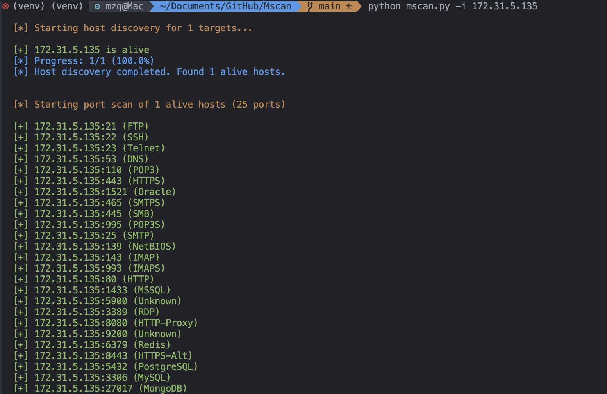

# Mscan - 多功能安全扫描工具


Mscan 是一个功能强大的安全扫描工具，集成了端口扫描、Web 服务识别、SSH 爆破等功能。

作者: mzq

## 主要功能

- 🚀 **端口扫描**
  - 支持 IP、CIDR、IP 范围扫描
  - 多种预定义端口模式
  - 智能主机存活检测
  - 高性能并发扫描

- 🌐 **Web 服务识别**
  - CMS 指纹识别
  - Web 技术栈检测
  - 服务器类型识别
  - 编程语言检测
  - 前端框架识别

- 🔑 **SSH 爆破**
  - 智能服务识别
  - 多线程并发爆破
  - 自定义用户名密码字典
  - 自动跳过无效目标

- 📊 **HTML 报告**
  - 美观的 Web 界面
  - 可搜索的数据表格
  - 详细的扫描结果
  - 技术组件分析

## 项目结构

- **src/**: 源代码目录
- **tests/**: 测试用例目录
- **docs/**: 文档目录
- **requirements.txt**: 项目依赖文件
- **README.md**: 项目说明文件

## 安装与使用

1. 克隆项目：
   ```bash
   git clone https://github.com/yourusername/mscan.git
   cd mscan
   ```

2. 安装依赖：
   ```bash
   pip install -r requirements.txt
   ```

3. 运行工具：
   ```bash
   python mscan.py
   ```

## 使用示例

在运行工具后，您可以使用以下命令进行端口扫描：
```bash
python mscan.py -p 80,443 -t 192.168.1.1
```
这将扫描目标 IP 的 80 和 443 端口。

## 贡献

欢迎任何形式的贡献！请查看 [贡献指南](CONTRIBUTING.md) 以获取更多信息。

## 许可证

本项目采用 MIT 许可证，详细信息请查看 [LICENSE](LICENSE) 文件。

## 联系方式

如有任何问题或建议，请联系作者 mzq，邮箱: mzq@example.com。
