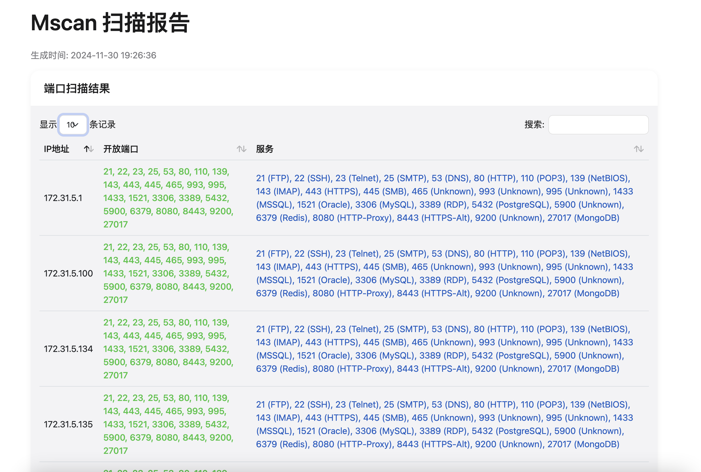
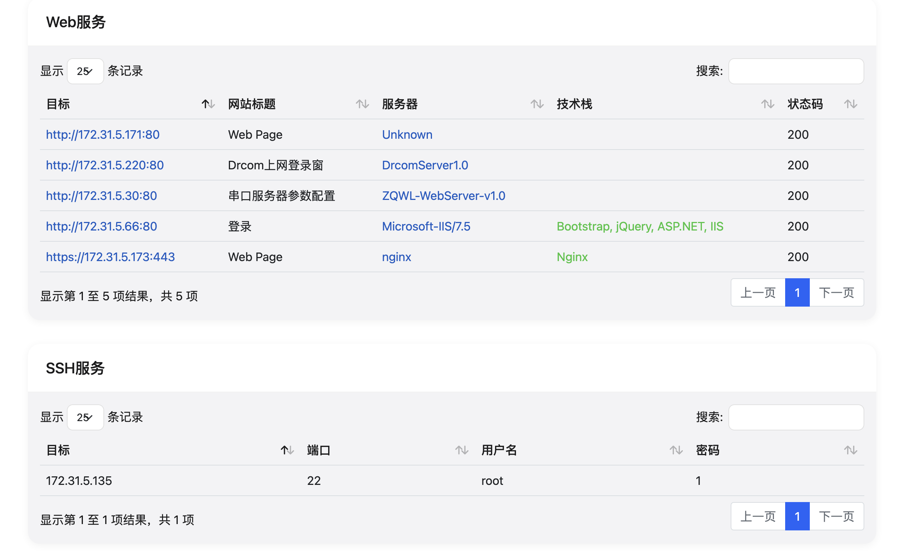

# Mscan - 多功能安全扫描工具


Mscan 是一个功能强大的安全扫描工具，集成了端口扫描、Web 服务识别、SSH 爆破等功能。

作者: mzq

## 主要功能

- 🚀 **端口扫描**
  - 支持 IP、CIDR、IP 范围扫描
  - 多种预定义端口模式
  - 智能主机存活检测
  - 高性能并发扫描

- 🌐 **Web 服务识别**
  - CMS 指纹识别
  - Web 技术栈检测
  - 服务器类型识别
  - 编程语言检测
  - 前端框架识别

- 🔑 **SSH 爆破**
  - 智能服务识别
  - 多线程并发爆破
  - 自定义用户名密码字典
  - 自动跳过无效目标

- 📊 **HTML 报告**
  - 美观的 Web 界面
  - 可搜索的数据表格
  - 详细的扫描结果
  - 技术组件分析

## 安装说明

1. 克隆项目：
   ```bash
   git clone https://github.com/yourusername/mscan.git
   cd mscan
   ```

2. 创建虚拟环境：
   ```bash
   python -m venv venv
   
   # Windows激活虚拟环境
   venv\Scripts\activate
   
   # Linux/Mac激活虚拟环境
   source venv/bin/activate
   ```

3. 安装依赖：
   ```bash
   pip install -r requirements.txt
   ```

## 使用方法

### 基本用法

```bash
python mscan.py -i <目标> [选项]
```



### 扫描目标支持的格式

- 单个IP: `python mscan.py -i 192.168.1.1`
- CIDR格式: `python mscan.py -i 192.168.1.0/24`
- IP范围: `python mscan.py -i 192.168.1.1-192.168.1.254`
- 从文件读取: `python mscan.py -i @targets.txt`
- 指定URL: `python mscan.py -u http://example.com`

### 端口扫描选项

```bash
# 使用预定义端口模式
python mscan.py -i 192.168.1.0/24 -m common  # 扫描常用端口
python mscan.py -i 192.168.1.0/24 -m minimal # 仅扫描最基本端口
python mscan.py -i 192.168.1.0/24 -m full    # 全端口扫描

# 自定义端口
python mscan.py -i 192.168.1.1 -p 80,443,8080-8090
```

预定义端口模式：
- `minimal`: 仅扫描 80,443,8080
- `common`: 扫描常见服务端口
- `full`: 扫描全部端口 (1-65535)

### SSH 爆破选项

```bash
# 使用自定义字典
python mscan.py -i 192.168.1.1 --user-file users.txt --pass-file passwords.txt

# 禁用 SSH 爆破
python mscan.py -i 192.168.1.1 --no-ssh
```

### Web 服务选项

```bash
# 仅扫描 Web 服务
python mscan.py -u http://example.com

# 禁用 Web 服务识别
python mscan.py -i 192.168.1.1 --no-web
```

### 输出选项

```bash
# 生成 HTML 报告
python mscan.py -i 192.168.1.1 -o report.html

# 生成 JSON 报告
python mscan.py -i 192.168.1.1 -o report.json

# 指定报告目录
python mscan.py -i 192.168.1.1 --report-dir /path/to/reports

# 禁用报告生成
python mscan.py -i 192.168.1.1 --no-report
```

### 性能调优

```bash
# 调整线程数
python mscan.py -i 192.168.1.0/24 -t 100

# 详细输出
python mscan.py -i 192.168.1.1 -v
```

## 完整参数说明

```
参数:
  -h, --help            显示帮助信息
  -i, --ip IP          目标IP/CIDR/范围
  -u, --url URL        目标URL
  -f, --file FILE      从文件读取目标
  -m, --mode {common,minimal,full}
                       预定义端口扫描模式
  -p, --ports PORTS    自定义端口列表
  --no-web             禁用Web服务识别
  --no-ssh             禁用SSH爆破
  --user-file FILE     SSH用户名字典
  --pass-file FILE     SSH密码字典
  -o, --output FILE    输出文件路径
  --no-report          禁用报告生成
  --report-dir DIR     报告保存目录
  -t, --threads N      线程数 (默认: 500)
  -v, --verbose        详细输出模式
```

## 使用示例

1. 扫描内网C段并进行服务识别：
```bash
python mscan.py -i 192.168.1.0/24 -m common -t 100
```

2. 对指定目标进行全端口扫描：
```bash
python mscan.py -i 192.168.1.1 -m full -o full_scan.html
```

3. 扫描指定URL并识别CMS：
```bash
python mscan.py -u http://example.com -o web_scan.html
```

4. 对SSH服务进行密码爆破：
```bash
python mscan.py -i 192.168.1.1 -p 22 --user-file users.txt --pass-file pass.txt
```

## 注意事项

1. 建议在测试环境中使用较大的线程数，在生产环境中使用较小的线程数
2. 全端口扫描耗时较长，建议针对性使用 common 或 minimal 模式
3. SSH 爆破功能请谨慎使用，避免账户锁定
4. 建议使用 -v 参数查看详细扫描过程
5. 扫描结果默认保存在 reports 目录下

## 贡献

欢迎任何形式的贡献！请查看 [贡献指南](CONTRIBUTING.md) 以获取更多信息。

## 许可证

本项目采用 MIT 许可证，详细信息请查看 [LICENSE](LICENSE) 文件。

## 联系方式

如有任何问题或建议，请联系作者 mzq，邮箱: mzq@example.com。
